# AgriEdge AI — μT-Kernel 3.0 Edge AI Precision Agriculture & Crop Protection System

[](https://www.renesas.com)
[-blue.svg)](https://www.tron.org)
[-green.svg)](https://www.arm.com)
[](LICENSE)
[](https://www.python.org)

> **TRON × AI International Competition Entry**  
> Developed by the AgriEdge AI Team at NIST University (School of Electronics and Communication Engineering), Berhampur, Odisha, India.  
> **Mentor:** Dr. Sandipan Mallik  
> **Team Members:** Atanu Jana, Snehal Panda, Jagan Swain, Manoswini Nahak, Arpita Sahu.

---

## 1. Overview & Vision

**AgriEdge AI** is a fully autonomous, solar-powered, offline edge intelligence system designed for smallholder farmers. Operating on the **Renesas EK-RA8P1** evaluation kit (Arm Cortex-M85 @ 1 GHz + Arm Ethos-U55 NPU), the system delivers real-time foliar pathology diagnostics, lesion progression aging, and autonomous treat/prune triage without requiring cloud connectivity or internet access.

By combining the deterministic real-time multitasking of **$\mu$T-Kernel 3.0** with a high-efficiency **dual-stage INT8 AI cascade** on the Ethos-U55 NPU, AgriEdge AI achieves sub-4 ms inference with bounded sensor-to-actuator latency.

---

## 2. System Architecture

```mermaid
graph TD
    subgraph Hardware["Renesas EK-RA8P1 Dev Kit"]
        M85["Arm Cortex-M85 @ 1 GHz"]
        NPU["Arm Ethos-U55 NPU (256 MAC/cycle)"]
        SRAM["2,048 KiB SRAM (Dual Arenas)"]
        Flash["8,192 KiB Flash (Weights Storage)"]
        Cam["Kit Camera (FSP Line Buffer)"]
        GLCDC["Kit LCD / SCI8 UART"]
    end

    subgraph RTOS["μT-Kernel 3.0 Multitasking Engine"]
        T1["SensorTask (Pri 5)<br/>Captures frame, signals semid_ai"]
        T2["AITask (Pri 7)<br/>Runs Layer 1 + Layer 2 Cascade"]
        T3["ControlTask (Pri 8)<br/>Applies CMD_NONE / TREAT / PRUNE"]
        T4["UITask (Pri 10)<br/>Updates LCD & UART Telemetry"]
        
        T1 -- "tk_sig_sem(semid_ai)" --> T2
        T2 -- "tk_wup_tsk(tskid_control)" --> T3
        T3 -- "tk_wup_tsk(tskid_ui)" --> T4
    end

    subgraph AI_Cascade["Dual-Layer AI Engine (Ethos-U55 INT8)"]
        In["Input Camera Buffer (16-byte aligned)"] --> L1["Layer 1: Disease Classifier<br/>(MobileNetV2-0.5 INT8 / 15 Classes)"]
        L1 --> OOD{"Energy OOD Gate<br/>E(x) < -1.6006?"}
        OOD -- "Non-leaf / Clutter" --> Abstain["ABSTAIN / Reject"]
        OOD -- "Valid Leaf" --> L1_Class{"Class == Healthy?"}
        L1_Class -- "Yes" --> CMD_None["CMD_NONE (Healthy Status)"]
        L1_Class -- "Disease Detected" --> L2["Layer 2: Lesion Age Regressor<br/>(Predicts Age D in Days [0-20])"]
        L2 --> Triage{"D <= 5.0 Days?"}
        Triage -- "Early/Expansion (<= 5d)" --> Treat["CMD_TREAT (Micro-spray viable tissue)"]
        Triage -- "Late/Collapse (> 5d)" --> Prune["CMD_PRUNE (Petiole excision of spore reservoir)"]
    end
```



---

## 3. Real-Time Multitasking Engine ($\mu$T-Kernel 3.0)

The system software runs under **$\mu$T-Kernel 3.0 (BSP2)**, guaranteeing deterministic scheduling and millisecond response times:

| Task Name | Priority | Stack Size | Synchronization Primitive | Core Functionality |
|---|:---:|:---:|:---:|---|
| **`SensorTask`** | **5** (Highest) | 1,024 B | `tk_sig_sem(semid_ai, 1)` | Periodically captures camera frame lines into 16-byte aligned buffers. Never blocked by AI execution. |
| **`AITask`** | **7** | 8,192 B | `tk_wai_sem(semid_ai, 1, TMO_FEVR)` | Executes the INT8 dual-stage AI cascade on the Ethos-U55 NPU without dynamic memory allocation (`malloc`). Signals `ControlTask`. |
| **`ControlTask`** | **8** | 1,024 B | `tk_slp_tsk(TMO_FEVR)` | Evaluates triage rules and outputs software commands (`CMD_NONE`, `CMD_TREAT`, `CMD_PRUNE`). Wakes `UITask`. |
| **`UITask`** | **10** (Lowest) | 1,024 B | `tk_slp_tsk(TMO_FEVR)` | Updates on-board GLCDC display and emits timestamped telemetry traces via SCI8 UART. |

### C / C++ Interfacing
- **Entry Point**: [`Application/app_main.c`](file:///c:/Users/jagan/OneDrive/Documents/TRON/mtk3bsp2_ra8p1_ek%20v2/mtk3bsp2_ra8p1_ek/Application/app_main.c) initializes semaphores, tasks, and task scheduling via `usermain()`.
- **Inference Wrapper**: [`src/ai_interference.cpp`](file:///c:/Users/jagan/OneDrive/Documents/TRON/mtk3bsp2_ra8p1_ek%20v2/mtk3bsp2_ra8p1_ek/src/ai_interference.cpp) exposes `extern "C"` APIs (`ai_init()`, `ai_run_inference()`) to $\mu$T-Kernel. It invokes the Renesas FSP driver `RM_ETHOSU_Open()` and configures TensorFlow Lite for Microcontrollers (TFLM).

---

## 4. Dual-Layer AI Model Cascade

### Layer 1: Disease Pathology Classifier & Open-Set OOD Gate
- **Teacher Model A (GPU / Cloud)**: `ConvNeXt-Tiny` backbone + learnable Generalized Mean Pooling (GeM, $p=3.0$) + BN-Neck head. Evaluated on a strictly leaf-grouped, duplicate-purged 70/15/15 split ($N = 2,710$ test samples, 0 shared physical leaves).
  - **Top-1 Accuracy**: **99.15%** | **Macro-F1**: **98.77%** | **Balanced Accuracy**: **98.37%**
- **Student Model B (MCU Target)**: Vela-safe `MobileNetV2-0.5` utilizing **fused ReLU6** and **Global Average Pooling** (no unsupported ops like `POW`, SiLU, or SE blocks).
  - Distilled via soft-target KL divergence ($T=3.0, \alpha=0.6$).
  - **Parameters**: **706,895** (**39.4× reduction** relative to Model A).
  - **Top-1 Accuracy**: **96.86%** | **Macro-F1**: **96.71%** | **Top-3 Accuracy**: **99.85%**
- **Anti-Shortcut Generalization**:
  - ExG + HSV + Otsu + GrabCut segmentation paired with `RandomBackgroundSwap` breaks laboratory photo-booth background memorization.
  - **Leaf-Only Test Accuracy**: **98.67%** (retains diagnostic signal with blanked background).
  - **Background-Only Test Accuracy**: **21.51%** (collapses near chance 6.67%, verifying lesion dependence).
- **Open-Set Rejection**:
  - Temperature Scaling ($T^* = 0.5571$) calibrates probabilities.
  - Energy score $E(x) = -T \cdot \log \sum \exp(f_c/T)$ with threshold **-1.6006** achieves **0.9922 AUROC** and **0.67% FPR95** to reject field clutter (soil, hands, weeds).

### Layer 2: Lesion Progression Age Regressor ($D$) & Treat/Prune Triage
- **Biological Progression Modeling**:
  - **Days 0–3 (Incubation)**: Pinprick chlorosis, localized infection.
  - **Days 3–5 (Expansion)**: Expanding necrotic centers with chlorotic halos; foliar tissue remains viable.
  - **Days > 5 (Collapse / Sporulation)**: Structural collapse; foliar tissue becomes an active spore reservoir.
- **Closed-Loop Action Rules**:
  $$\text{Action} = \begin{cases} 
  \mathbf{CMD\_NONE} & \text{Class is Healthy} \\
  \mathbf{CMD\_TREAT} & \text{Class is Diseased and } D \le 5.0\text{ days (targeted micro-spray)} \\
  \mathbf{CMD\_PRUNE} & \text{Class is Diseased and } D > 5.0\text{ days (petiole excision to stop spore spread)}
  \end{cases}$$

---

## 5. Renesas EK-RA8P1 / Arm Ethos-U55 Hardware Budgets

All INT8 operators are verified using the **Arm Vela 5.1.0** compiler for the Ethos-U55 (256 MAC/cycle configuration):

| Resource / Metric | Layer 1 Classifier | Layer 2 Regressor | Dual Cascade Total | RA8P1 Capacity | Available Headroom |
|---|:---:|:---:|:---:|:---:|:---:|
| **Flash / MRAM (Weights)** | 786.3 KiB | ~560.2 KiB | **1,346.5 KiB** | 8,192 KiB | **83.6% Free** |
| **Peak SRAM (Tensor Arena)** | 402.1 KiB | ~128.0 KiB | **~530.1 KiB** | 2,048 KiB | **74.1% Free** |
| **NPU Offload Placement** | 100.0% (65/65 ops) | 100.0% | **100.0% (0 CPU fallback)** | Ethos-U55 Native | **Optimal** |
| **Inference Latency (@ 500 MHz)** | 3.82 ms | 2.95 ms | **6.77 ms (~148 FPS)** | Real-Time Deadline | **Deterministic** |
| **Compute-Bound Cycle Ratio** | 78.7% | 74.2% | **76.5% avg** | NPU Utilization | **High** |

---

## 6. Repository Layout

```
TRON/
├── .gitignore                                      # Comprehensive ignore rules for embedded C & Python ML
├── README.md                                       # Main system architecture and deployment guide
├── AgriEdge_AI_Research_Deck.pptx                  # 21-slide technical research presentation deck
├── entry-id-77965.docx                             # Official TRON × AI competition proposal
│
├── mtk3bsp2_ra8p1_ek v2/mtk3bsp2_ra8p1_ek/         # Renesas e² studio embedded firmware project
│   ├── Application/
│   │   └── app_main.c                              # μT-Kernel 3.0 tasks, semaphores, and main loop
│   ├── src/
│   │   ├── ai_interference.cpp                     # TFLM + Ethos-U55 driver inference bridge
│   │   ├── hal_entry.c                             # Hardware entry point & kernel bootstrap
│   │   ├── leaf_disease_model.h                    # Model array declarations
│   │   └── model_data.h                            # INT8 compiled model binary array
│   └── mtk3_bsp2/                                  # μT-Kernel 3.0 BSP2 source tree
│
├── Layer2/                                         # Layer 2 AI: Python deep learning & edge deployment package
│   ├── src/agrobot/
│   │   ├── data/                                   # Manifest parsing, grouped splits, ExG segmentation
│   │   ├── models/                                 # ConvNeXt teacher, GeM pooling, MobileNetV2 student
│   │   ├── train.py                                # Model A training pipeline (AMP, Cosine LR, EMA)
│   │   ├── distill.py                              # Knowledge distillation engine for Model B
│   │   ├── calibrate.py                            # Temperature scaling & Energy-based OOD rejection
│   │   ├── diagnose.py                             # Spatial ablation & Grad-CAM visualizer
│   │   ├── export_onnx.py                          # ONNX graph export
│   │   ├── export_tflite_int8.py                   # Quantization & representative dataset calibration
│   │   ├── vela_check.py                           # Arm Vela compilation & NPU validation
│   │   ├── infer.py                                # Inference engine with open-set rejection API
│   │   └── camera_demo.py                          # Real-time webcam diagnostic HUD
│   ├── tests/                                      # Comprehensive unit tests (71/71 passing)
│   ├── ruhmi/                                      # RA8P1 firmware integration notes & headers
│   ├── artifacts/                                  # Walkthroughs and phase implementation plans
│   └── reports/                                    # Formal evaluation report, figures, and CSV metrics
│
├── Layer1/                                         # Baseline 39-class TFLite INT8 and Vela summary
│   ├── model_v1.tflite                             # Quantized INT8 model
│   ├── model_v1_vela.tflite                        # Vela-compiled Ethos-U55 binary
│   └── model_v1_metadata.json                      # Class mappings and quantization scale/zero-point
│
└── Dataset/                                        # Local PlantVillage dataset (gitignored)
    └── PlantVillage/                               # 15 foliar pathology classes (20,600+ images)
```

---

## 7. Quickstart Guide

### 7.1 Python AI Environment & Testing
Ensure **Python 3.11** is installed:
```powershell
# Navigate to the Python Layer2 module
cd "Layer2"

# Install package in editable mode with dependencies
pip install -e .

# Run the test suite (71 verified tests)
pytest tests -q
```

### 7.2 Run Live Diagnostic Camera Demo
Test real-time inference with automated background rejection and telemetry HUD:
```powershell
python -m agrobot.camera_demo --checkpoint "path/to/best_model.pt" --calibration "path/to/calibration.json"
```

### 7.3 Embedded Firmware Build & Flash (Renesas e² studio)
1. Open **Renesas e² studio** (v2024-01 or later) with **FSP v5.x** installed.
2. Select **File $\to$ Import Existing Projects into Workspace** and select:
   `TRON/mtk3bsp2_ra8p1_ek v2/mtk3bsp2_ra8p1_ek`
3. Verify that the project configuration matches:
   - **Board**: `EK-RA8P1` (R7FA8P1AHECBD)
   - **RTOS**: $\mu$T-Kernel 3.0
   - **Compiler**: GNU Arm Embedded Toolchain (`13.2.rel1` or `12.3.rel1`)
   - **FSP Driver**: `RM_ETHOSU` enabled in Stacks
4. Build the project (`Ctrl + B`). The `.elf` binary will be generated in `Debug/`.
5. Connect the Renesas EK-RA8P1 board via the onboard **J-Link OBD** USB port and flash the binary.
6. Open a serial terminal (115200 baud, 8-N-1) on the J-Link COM port to observe $\mu$T-Kernel task execution and inference logs.

---

## 8. License & Acknowledgements

- **Operating System**: [$\mu$T-Kernel 3.0](https://www.tron.org) is provided under the T-License 2.2 by the TRON Forum.
- **Hardware & Drivers**: Renesas Flexible Software Package (FSP) & Arm Ethos-U Core Platform Drivers.
- **Dataset**: Built upon the open-access [PlantVillage](https://github.com/spMohanty/PlantVillage-Dataset) pathology corpus, cleansed of duplicates and leakage.
